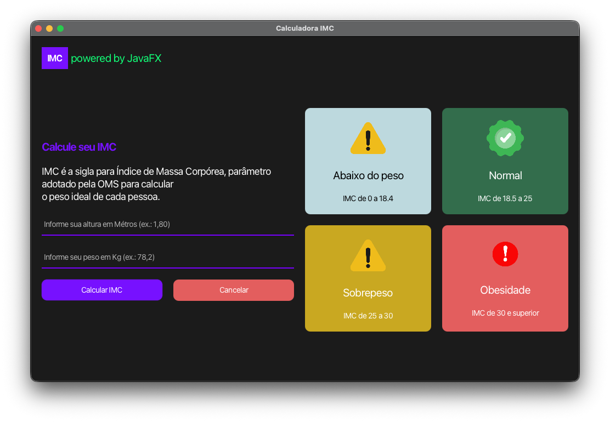

# IMC Calculator | Calculadora de IMC

<div align="center">




**A educational JavaFX application to calculate Body Mass Index (BMI)**

**Uma aplicação JavaFX educacional para calcular Índice de Massa Corpórea (IMC)**

</div>

---

## 📋 Quick Navigation | Navegação Rápida

- [English](#english)
- [Português](#português)

---

## English

### 🎯 Overview

IMC Calculator is a user-friendly desktop application built with JavaFX that helps users calculate and understand their Body Mass Index. This project serves as an educational resource for learning Java and Object-Oriented Programming concepts.

### ✨ Features

- **Simple Input Form**: Intuitive interface for entering height and weight
- **Instant Calculation**: Real-time BMI calculation with immediate feedback
- **Visual Categorization**: 4 BMI categories with color-coded visual indicators:
  - Underweight (Blue)
  - Normal Weight (Green)
  - Overweight (Yellow)
  - Obesity (Red)
- **Interactive UI**: Modern JavaFX interface with smooth transitions
- **Multilingual**: Instructions available in Portuguese
- **Icon Support**: Visual icons for better user understanding

### 📁 Project Structure

```
com.github.imccalculator/
├── app/
│   ├── App.java                    (Main application class)
│   └── components/
│       ├── Header.java             (Application header)
│       ├── Form.java               (Input form)
│       ├── Card.java               (Info cards)
│       ├── CardContainer.java      (Category cards grid)
│       └── Result.java             (Result display)
├── models/
│   └── Icons.java                  (Icon enumeration)
└── resources/
    └── style.css                   (Styling)
```

### 🚀 Getting Started

#### Prerequisites
- Java Development Kit (JDK) 11 or higher
- JavaFX SDK
- Terminal/Command Prompt

#### Installation

1. **Clone or download the project**
   ```bash
   cd imc-calculator
   ```

2. **Compile the project**
   ```bash
   javac --module-source-path src -d bin -m com.github.imccalculator
   ```

3. **Run the application**
   ```bash
   java --module-path bin -m com.github.imccalculator/com.github.imccalculator.app.App
   ```

### 📖 Usage

1. Launch the application
2. Enter your height in meters (e.g., 1.80)
3. Enter your weight in kilograms (e.g., 75)
4. Click "Calcular IMC" to calculate
5. View your BMI result and category
6. Click "Calcular novamente" to perform another calculation

### 📊 BMI Categories

| Category | BMI Range | Status | Color |
|----------|-----------|--------|-------|
| Underweight | < 18.5 | Below normal | 🔵 Blue |
| Normal | 18.5 - 25 | Healthy | 🟢 Green |
| Overweight | 25 - 30 | Above normal | 🟡 Yellow |
| Obesity | ≥ 30 | Obese | 🔴 Red |

### 🏗️ Architecture

The application follows the **MVC (Model-View-Controller)** pattern:

- **Model**: `Icons.java` - Data structures
- **View**: Components (`Header`, `Form`, `Card`, etc.) - UI elements
- **Controller**: `Form.java`, `App.java` - Business logic and event handling

### 🎨 Styling

The application uses JavaFX CSS for styling with a modern dark theme:
- Primary Color: Purple (#71f)
- Background: Dark Gray (#1b1b1b)
- Category-specific colors for visual feedback

### 📚 Learning Objectives

This project demonstrates:
- ✅ JavaFX UI framework usage
- ✅ Object-Oriented Programming (OOP) principles
- ✅ Event handling and user interaction
- ✅ Component composition and reusability
- ✅ CSS styling in JavaFX
- ✅ Module system in Java 9+
- ✅ Design patterns (MVC, Component pattern)

### 👨‍💻 Author

**João Gabriel Valentim Theodoro**
- Version 1.0
- Educational Project for Java Learning

### 📝 License

This project is provided for educational purposes.

---

## Português

### 🎯 Visão Geral

A Calculadora de IMC é uma aplicação de desktop amigável construída com JavaFX que ajuda os usuários a calcular e entender seu Índice de Massa Corpórea. Este projeto serve como recurso educacional para aprender conceitos de Java e Programação Orientada a Objetos.

### ✨ Características

- **Formulário Simples**: Interface intuitiva para inserir altura e peso
- **Cálculo Instantâneo**: Cálculo de IMC em tempo real com feedback imediato
- **Categorização Visual**: 4 categorias de IMC com indicadores visuais codificados por cor:
  - Abaixo do peso (Azul)
  - Peso Normal (Verde)
  - Sobrepeso (Amarelo)
  - Obesidade (Vermelho)
- **Interface Interativa**: Interface JavaFX moderna com transições suaves
- **Suporte Multilíngue**: Instruções disponíveis em português
- **Suporte a Ícones**: Ícones visuais para melhor compreensão do usuário

### 📁 Estrutura do Projeto

```
com.github.imccalculator/
├── app/
│   ├── App.java                    (Classe principal)
│   └── components/
│       ├── Header.java             (Cabeçalho)
│       ├── Form.java               (Formulário de entrada)
│       ├── Card.java               (Cartões de informação)
│       ├── CardContainer.java      (Grade de categorias)
│       └── Result.java             (Exibição de resultado)
├── models/
│   └── Icons.java                  (Enumeração de ícones)
└── resources/
    └── style.css                   (Estilização)
```

### 🚀 Começando

#### Pré-requisitos
- Java Development Kit (JDK) 11 ou superior
- JavaFX SDK
- Terminal/Prompt de Comando

#### Instalação

1. **Clone ou baixe o projeto**
   ```bash
   cd imc-calculator
   ```

2. **Compile o projeto**
   ```bash
   javac --module-source-path src -d bin -m com.github.imccalculator
   ```

3. **Execute a aplicação**
   ```bash
   java --module-path bin -m com.github.imccalculator/com.github.imccalculator.app.App
   ```

### 📖 Como Usar

1. Inicie a aplicação
2. Digite sua altura em metros (ex: 1.80)
3. Digite seu peso em quilogramas (ex: 75)
4. Clique em "Calcular IMC" para calcular
5. Veja seu resultado de IMC e categoria
6. Clique em "Calcular novamente" para realizar outro cálculo

### 📊 Categorias de IMC

| Categoria | Intervalo de IMC | Status | Cor |
|-----------|------------------|--------|-----|
| Abaixo do peso | < 18.5 | Abaixo do normal | 🔵 Azul |
| Normal | 18.5 - 25 | Saudável | 🟢 Verde |
| Sobrepeso | 25 - 30 | Acima do normal | 🟡 Amarelo |
| Obesidade | ≥ 30 | Obeso | 🔴 Vermelho |

### 🏗️ Arquitetura

A aplicação segue o padrão **MVC (Model-View-Controller)**:

- **Model**: `Icons.java` - Estruturas de dados
- **View**: Componentes (`Header`, `Form`, `Card`, etc.) - Elementos de UI
- **Controller**: `Form.java`, `App.java` - Lógica de negócio e manipulação de eventos

### 🎨 Estilização

A aplicação usa CSS do JavaFX para estilização com um tema escuro moderno:
- Cor Primária: Roxo (#71f)
- Fundo: Cinza Escuro (#1b1b1b)
- Cores específicas por categoria para feedback visual

### 📚 Objetivos de Aprendizado

Este projeto demonstra:
- ✅ Uso do framework JavaFX
- ✅ Princípios de Programação Orientada a Objetos (POO)
- ✅ Manipulação de eventos e interação do usuário
- ✅ Composição e reutilização de componentes
- ✅ Estilização CSS em JavaFX
- ✅ Sistema de módulos do Java 9+
- ✅ Padrões de design (MVC, padrão de componentes)

### 👨‍💻 Autor

**João Gabriel Valentim Theodoro**
- Versão 1.0
- Projeto Educacional para Aprendizado de Java

### 📝 Licença

Este projeto é fornecido para fins educacionais.

---

<div align="center">

**Last Updated**: December 10, 2025

**Última Atualização**: 10 de dezembro de 2025

</div>
